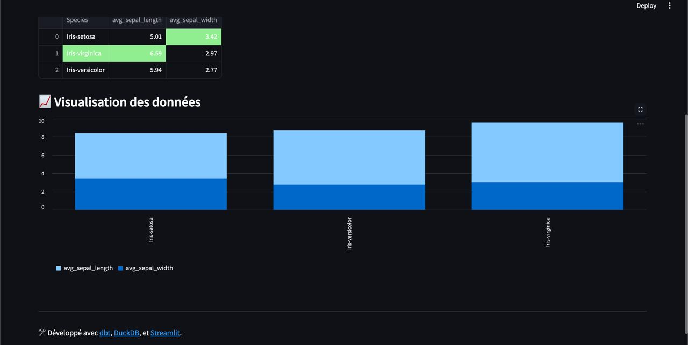
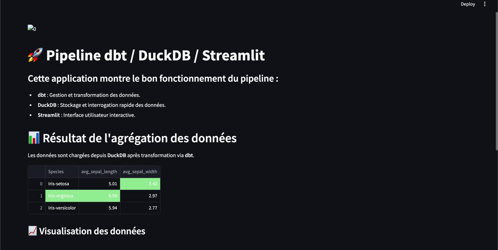

# 📊 Projet d'initiation : dbt + DuckDB + Streamlit

<p align="center">
  
  
  
</p>

---

## 🚀 Objectif du projet

Ce projet vise à fournir une **introduction pratique** à trois outils puissants :  
**dbt**, **DuckDB**, et **Streamlit**.  
Vous apprendrez à construire un pipeline analytique local pour manipuler, transformer et visualiser des données, tout en comprenant le rôle de chaque technologie.

---







## 🛠️ Technologies utilisées et leur rôle

### 1️⃣ dbt (Data Build Tool)

- **Rôle** : Gérer la transformation des données de manière modulaire et reproductible.
- **Pourquoi utiliser dbt ?**
  - Centralise vos transformations SQL dans un environnement structuré.
  - Génère automatiquement de la documentation des modèles.
  - Gère des dépendances claires entre vos modèles (via un DAG - Directed Acyclic Graph).
- **Cas d'usage dans le projet** :
  - Importation du dataset Iris.
  - Transformation des données : agrégations (moyenne des longueurs et largeurs de pétales/sépales).
  - Création de vues SQL exploitables dans DuckDB.

### 2️⃣ DuckDB

- **Rôle** : Fournir un moteur SQL local ultra-rapide.
- **Pourquoi utiliser DuckDB ?**
  - Idéal pour les analyses rapides sans dépendre d'une base de données distante.
  - Compatible avec dbt pour stocker les résultats des transformations.
  - Léger et facile à intégrer à des projets Python.
- **Cas d'usage dans le projet** :
  - Stockage du dataset Iris dans un fichier `.duckdb`.
  - Hébergement des vues générées par dbt.
  - Fourniture des données agrégées à Streamlit.

### 3️⃣ Streamlit

- **Rôle** : Offrir une interface utilisateur interactive pour visualiser les données.
- **Pourquoi utiliser Streamlit ?**
  - Permet de créer des dashboards rapidement avec Python.
  - Se connecte directement aux résultats DuckDB générés par dbt.
  - Rend les pipelines data accessibles même aux non-techniciens.
- **Cas d'usage dans le projet** :
  - Lecture des données agrégées depuis DuckDB.
  - Affichage sous forme de tableau et de graphiques interactifs.
  - Mise en avant du pipeline dbt / DuckDB / Streamlit.

---

## 📋 Étapes du projet

```bash
# 1️⃣ Mise en place de l’environnement

# Créez un environnement virtuel :
python3 -m venv venv
source venv/bin/activate   # Pour Mac/Linux
venv\Scripts\activate      # Pour Windows

# Installez les dépendances nécessaires :
pip install dbt-duckdb duckdb streamlit pandas

# Configurez dbt :
# Ajoutez un fichier profiles.yml :
echo "
first_dbt_test:
  outputs:
    dev:
      type: duckdb
      path: data/dev.duckdb
      threads: 1
  target: dev
" > ~/.dbt/profiles.yml

# 2️⃣ Pipeline dbt : Transformations des données

# Ajoutez votre source :
# Placez le fichier CSV dans le dossier data/.
# Déclarez votre source dans dbt (schema.yml) :
echo "
sources:
  - name: iris_source
    tables:
      - name: iris
" > models/schema.yml

# Créez des modèles dbt : Exemple de transformation (aggregated_iris.sql) :
echo "
SELECT
    Species,
    AVG(SepalLengthCm) AS avg_sepal_length,
    AVG(SepalWidthCm) AS avg_sepal_width
FROM {{ source('iris_source', 'iris') }}
GROUP BY Species
" > models/aggregated_iris.sql

# Générez les vues DuckDB :
dbt run

# 3️⃣ Streamlit : Visualisation interactive

# Créez une application Streamlit (app.py) :
echo "
import streamlit as st
import duckdb

st.set_page_config(page_title='Pipeline dbt + DuckDB + Streamlit', layout='wide')
st.title('🚀 Pipeline dbt + DuckDB + Streamlit')

con = duckdb.connect('data/dev.duckdb')
query = '''
    SELECT
        Species,
        AVG(SepalLengthCm) AS avg_sepal_length,
        AVG(SepalWidthCm) AS avg_sepal_width
    FROM main.iris_source
    GROUP BY Species
'''
result = con.execute(query).fetchdf()
st.dataframe(result)
st.bar_chart(result.set_index('Species'))
" > app.py

# Exécutez l’application :
streamlit run app.py

🎯 Points clés à retenir
Avec ce projet, vous avez appris à intégrer et exploiter trois technologies complémentaires, chacune jouant un rôle clé dans un pipeline analytique moderne :

dbt : Transformations SQL modulaire.
DuckDB : Base SQL locale rapide.
Streamlit : Visualisation interactive.